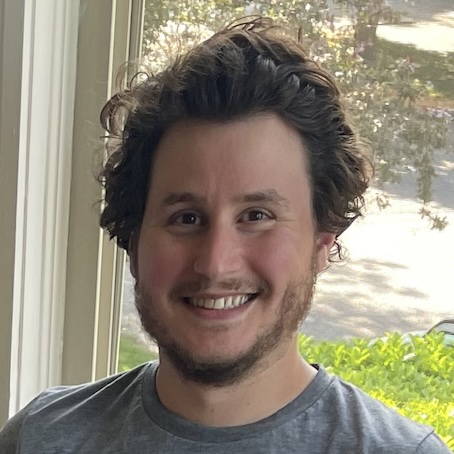

## About Me

I'm a researcher at Apple working on object-centric 3D perception. Previously, I
completed a PhD under [Zhuowen Tu](https://pages.ucsd.edu/~ztu/) at UC San Diego,
focusing on generative models and 2D perception.

[Google Scholar](https://scholar.google.com/citations?user=PASh6VEAAAAJ)

## Publications

* **Cubify Anything: Scaling Indoor 3D Object Detection** [\[arXiv\]](https://arxiv.org/abs/2412.04458) 
  Justin Lazarow, David Griffiths, Gefen Kohavi, Francisco Crespo, Afshin Dehghan
* **Instance Segmentation With Mask-Supervised Polygonal Boundary Transformers** (CVPR 2022) [\[PDF\]](https://openaccess.thecvf.com/content/CVPR2022/papers/Lazarow_Instance_Segmentation_With_Mask-Supervised_Polygonal_Boundary_Transformers_CVPR_2022_paper.pdf) [\[Code\]](https://github.com/mlpc-ucsd/BoundaryFormer) 
  Justin Lazarow, Weijian Xu, Zhuowen Tu
* **Learning Instance Occlusion for Panoptic Segmentation** (CVPR 2020) [\[arXiv\]](https://arxiv.org/abs/1906.05896) 
  Justin Lazarow\*, Kwonjoon Lee\*, Kunyu Shi\*, Zhuowen Tu
* **Introspective classification with convolutional nets** (NeurIPS 2017) [\[arXiv\]](https://arxiv.org/abs/1704.07816) 
  Long Jin, Justin Lazarow, Zhuowen Tu
* **Introspective neural networks for generative modeling** (ICCV 2017) [\[PDF\]](https://openaccess.thecvf.com/content_ICCV_2017/papers/Lazarow_Introspective_Neural_Networks_ICCV_2017_paper.pdf) 
  Justin Lazarow\*, Long Jin*, Zhuowen Tu
